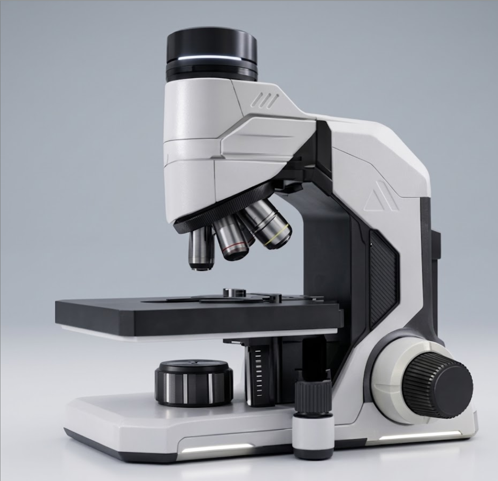

# Sphyra 1
Open-source digital microscope for digital pathology research (RUO)

Legacy digital pathology tries to build a factory around you - forcing your laboratory into bloated, slow, and multi-million dollar Whole Slide Imaging pipelines.
But you don't need a new factory - you need a better **hammer**. Sphyra 1 is a digital-native instrument designed to act as an extension of your own hands.

 

See here for working 3D point cloud https://studio.tripo3d.ai/workspace/generate/25497be9-af69-466f-ad90-2022d839dbc1

## Project Structure

All documentation can be found in the `docs` directory, which primarily contains explantions as well as engineering drawings. The 3D designs and project
files can be found in the `CAD` directory. `CAD/playground` is a working directory where as `CAD/src` contains the components included in the current working
version of the microscope. The `printing` directory contains `.stp` files for 3D printing as well some configuration files and documentation specific to printing.

## 3D Printing

This prototype is intended to be a fully-functional microscope that can be 3D printed using consumer-grade 3D printers. The brands of 3D printers tested and utilised in
this project are limited to:

- Creality K1C
- PLA Plus filaments for reliable printing and tolerances

## License

This project's hardware designs, schematics, and documentation are licensed under the [Creative Commons Attribution-NonCommercial 4.0 International License](https://creativecommons.org/licenses/by-nc/4.0/).

* **You are free to:** Share, copy, and modify these designs for personal, educational, or internal laboratory use.
* **Under the following terms:** You must give appropriate credit to the original design, and you **cannot** use these files or any modified versions for commercial purposes (selling kits, fully assembled units, or the designs themselves).
